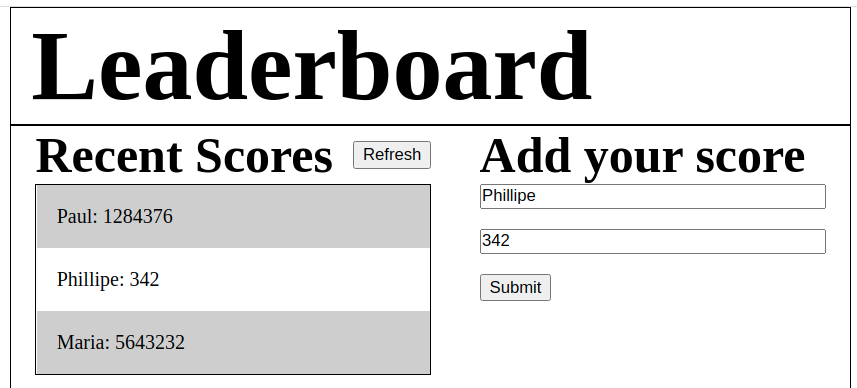

# Leaderboard

> This is a simple Leaderboard project

Features:
- API calls using async and fetch
## Built With

- Webpack
- Javascript
- Sass
## Live Demo

https://rokovarano.github.io/Leaderboard/
## Getting Started

**This is an example of how you may give instructions on setting up your project locally.**
**Modify this file to match your project, remove sections that don't apply. For example: delete the testing section if the currect project doesn't require testing.**

To get a local copy up and running follow these simple example steps.

### Prerequisites
- Node.js
### Setup
- clone the Repo: https://github.com/RokoVarano/Leaderboard.git
### Install
- In the cloned project folder, run 'npx webpack serve'
### Usage
- To add a new score, just type a name and a score in the corresponding fields and hit 'Submit'
- Hit 'Refresh' to load the current score list. 
- the game ID is saved in localStorage, so that the same game can be referenced multiple times
### Run tests
- No tests yet
## I learned:
- That API calls don't return objects, making it more comfortable to work withing their scope first
- That localStorage can be very useful to send params between async functions
## Authors

👤 **Rodrigo Ibaceta**

- GitHub: [Rodrigo Ibaceta](https://github.com/RokoVarano/)
- Twitter: [@Rodrigo](https://twitter.com/RodrigoIbacet11)
- LinkedIn: [LinkedIn](https://www.linkedin.com/in/rodrigo-ibaceta-a8657611a/)
## 🤝 Contributing

Contributions, issues, and feature requests are welcome!

Feel free to check the [issues page](../../issues/).

## Show your support

Give a ⭐️ if you like this project!

## Acknowledgments

- Hat tip to anyone whose code was used
- Inspiration
- etc

## 📝 License

This project is [MIT](./MIT.md) licensed.